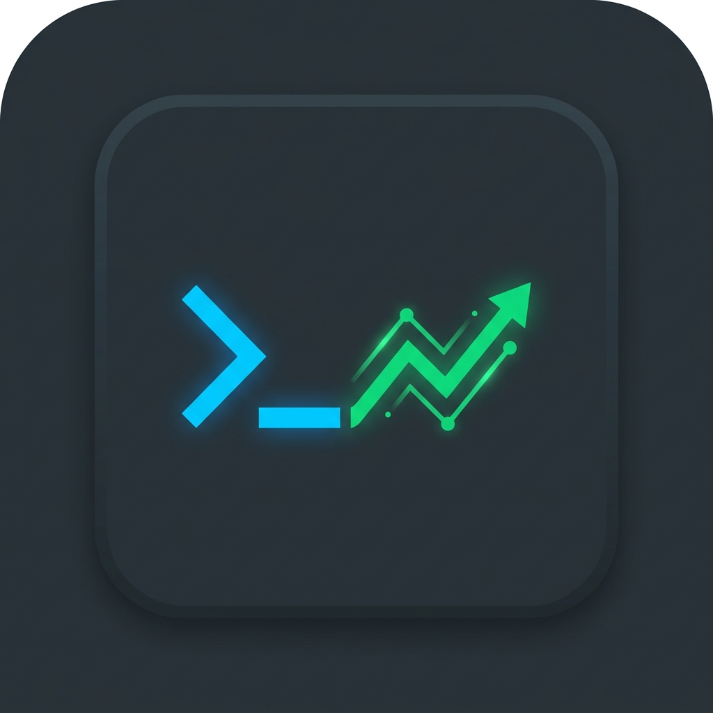

# Claude Menubar Telemetry 📊

A native macOS menu bar utility that provides real-time token usage, prompt caching efficiency, and subscription-quota telemetry for your **Claude Code** CLI sessions. 

The interface is styled with a developer-centric, dark-mode **JetBrains Mono IDE** aesthetic, featuring custom monospaced typography, clean console tables, and terminal-like indicators.

<div align="center">
  
</div>

---

## Key Features

- 🚀 **100% Native Swift/SwiftUI**: Compiled directly to a lightweight macOS app bundle (no heavy Electron wrappers). Launches instantly and consumes **< 20MB of RAM**.
- 📥 **Zero Setup Log Aggregator**: Automatically watches and parses your local Claude Code sessions stored in `~/.claude/projects/` line-by-line. No Anthropic API keys or proxies are required.
- ⏱️ **Live Quota Reset Countdown**: Tracks exactly when requests will "fall off" the rolling 5-hour window, with live countdown timers ticking down to show when your subscription limit frees up.
- ⚡ **Prompt Caching Efficiency**: Displays your caching hit ratios using a retro, ASCII-style command-line progress bar. It lets you monitor caching optimization (which offers a **90% discount** on cache-read tokens).
- 📂 **Multi-Model Breakdown**: Automatically groups and lists token usage and requests count per model (Claude Fable, Sonnet, Opus, etc.).
- 🎨 **JetBrains Mono UI**: Designed to blend into a developer's workspace with dark slate backgrounds (`#1E1F22`), grid borders (`#43454A`), and terminal indicators.
- 🛠️ **Demo Mode**: Includes a simulated mock telemetry toggle in the footer to showcase the user interface immediately.

---

## Design Showcase

The app uses the following JetBrains IDE color palette:
- **Background**: Deep Slate `#1E1F22`
- **Fields/Panels**: Lighter Slate `#2B2D30`
- **Grid Lines**: Muted Gray `#43454A`
- **Success Accent**: Emerald Green `#59A869`
- **Focus Accent**: Royal Blue `#3574F0`

The UI is structured as follows when you click the Menu Bar icon (`terminal` system icon):
1. **Header**: Shows active state (`● LOGS_ACTIVE` or `● DEMO_MODE`).
2. **Dashboard Grid**: Displays **5H Rolling Use**, **Next Reset Countdown**, **Weekly Use (7D)**, and **Claude Fable Use**.
3. **Model Usage Summary**: Monospaced table listing request and token metrics grouped per model.
4. **Upcoming Quota Resets**: ASCII timeline list detailing precisely when and where your previous requests expire from the 5h window, complete with ticking countdown timers.
5. **Footer Controls**: Options to toggle Demo mode, manually refresh statistics, see the last scan timestamp, or quit.

---

## Privacy & Safety

- **Private & Local-Only**: The application runs completely offline and locally. It does not send any statistics, telemetry, logs, or keys to third-party endpoints.
- **Read-Only**: The utility reads logs purely to accumulate numerical token values. It does not write to, delete, or modify any of your project or Claude session files.

---

## How to Build & Run

### Prerequisites
- A Mac running **macOS 12.0** or newer.
- **Xcode Command Line Tools** installed (provides the `swiftc` compiler). You can install it by running `xcode-select --install` in your terminal.

### Step 1: Clone the Repository
```bash
git clone https://github.com/juanmmm21/claude-menubar-telemetry.git
cd claude-menubar-telemetry
```

### Step 2: Build the Application
We provide an automated compilation script `build.sh` that cleans, transcodes the source image to a native macOS `.icns` format, compiles the binary, and packages the bundle structure:
```bash
chmod +x build.sh
./build.sh
```

### Step 3: Run and Install
Once the build is complete, you can launch the app directly:
```bash
open build/ClaudeTelemetry.app
```
To install it permanently, simply drag the compiled app inside the `build/` folder into your macOS `/Applications` directory.

---

## File Structure

```
├── build.sh                 # Standard macOS build script
├── .gitignore               # Excludes intermediate compiler targets
├── README.md                # Project documentation
└── src/
    ├── main.swift           # Application entry point
    ├── AppDelegate.swift    # Status bar button and NSPopover controllers
    ├── DashboardView.swift  # SwiftUI monospaced interface
    ├── TelemetryManager.swift# Log parsing logic, cache system & rates
    ├── Theme.swift          # Color palette & JetBrains Mono typography tokens
    └── AppIcon.png          # High-resolution source icon (1024x1024)
```

---

## How the Quota Window Works

- **Claude Pro/Enterprise Limits**: Anthropic subscription limits operate on a **rolling 5-hour window** rather than resetting at a fixed time of day (e.g., midnight).
- **Rolling Expiration**: Every request you make "resets" (freeing up quota slot) exactly **5 hours after** it was initiated.
- **Ticking Timeline**: This app reads request timestamps directly from your local logs, calculates their `timestamp + 5h` expiry mark, and groups them by minute to display a live countdown showing when your limits will refresh.

---

## Author

Desarrollado por **juanmmm21** (https://github.com/juanmmm21). 
*Senior Developer & Observability enthusiast.*
