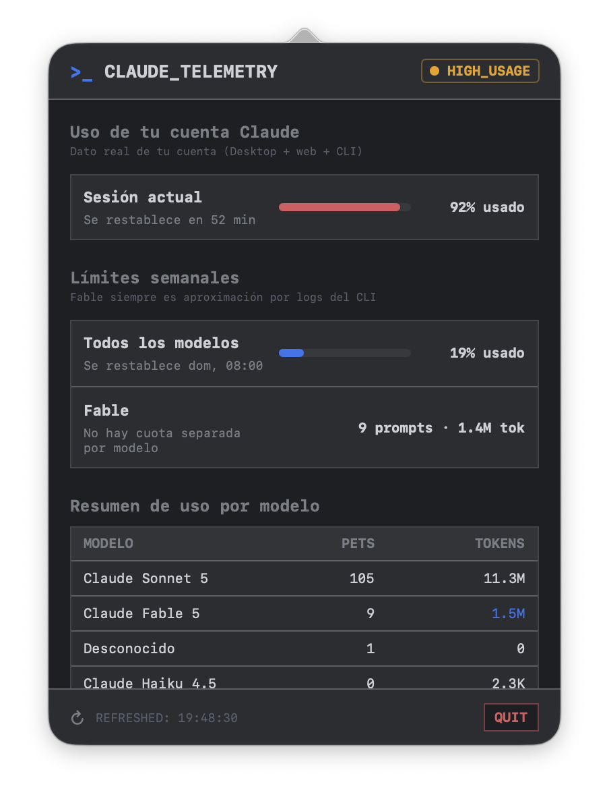

# Claude Menubar Telemetry

A native macOS menu bar utility that provides real-time token usage and subscription-quota telemetry for your **Claude Code** CLI sessions.

The interface is styled with a developer-centric, dark-mode **JetBrains Mono IDE** aesthetic, featuring custom monospaced typography, clean console tables, and terminal-like indicators.

<div align="center">
  
</div>

---

## Key Features

- **100% Native Swift/SwiftUI**: Compiled directly to a lightweight macOS app bundle (no heavy Electron wrappers). Launches instantly and consumes **< 20MB of RAM**.
- **Zero Setup Log Aggregator**: Automatically watches and parses your local Claude Code sessions stored in `~/.claude/projects/` line-by-line. No Anthropic API keys or proxies are required.
- **Real account-wide quota (optional)**: If you're signed in to Claude Code on this Mac, the app reuses that existing session to read your *actual* rate-limit usage across Desktop, web and CLI combined — not just an estimate from local CLI logs. See [Privacy & Safety](#privacy--safety) for exactly what that involves.
- **Live Reset Countdown**: Shows exactly when your current 5-hour session window resets, ticking down in real time.
- **Multi-Model Breakdown**: Automatically groups and lists token usage and requests count per model (Claude Fable, Sonnet, Opus, etc.).
- **JetBrains Mono UI**: Designed to blend into a developer's workspace with dark slate backgrounds (`#1E1F22`), grid borders (`#43454A`), and terminal indicators.
- **Demo Mode**: Includes a simulated mock telemetry toggle in the footer to showcase the user interface immediately.

---

## Design Showcase

The app uses the following JetBrains IDE color palette:
- **Background**: Deep Slate `#1E1F22`
- **Fields/Panels**: Lighter Slate `#2B2D30`
- **Grid Lines**: Muted Gray `#43454A`
- **Success Accent**: Emerald Green `#59A869`
- **Focus Accent**: Royal Blue `#3574F0`

The UI is structured as follows when you click the Menu Bar icon (`terminal` system icon):
1. **Header**: Shows active state (`● LOGS_ACTIVE` or `● DEMO_MODE`).
2. **Session usage**: A single progress bar for the current 5-hour window, with its real reset countdown when available.
3. **Weekly usage**: A progress bar for all-models weekly usage, plus a plain Fable requests/tokens counter — Anthropic doesn't expose a separate quota for Fable, so that row isn't shown as a percentage of anything.
4. **Model Usage Summary**: Monospaced table listing request and token metrics grouped per model.
5. **Footer Controls**: Options to toggle Demo mode, manually refresh statistics, see the last scan timestamp, or quit.

---

## Privacy & Safety

- **Local-first, with one optional real network call**: by default the app reads your local Claude Code session logs (`~/.claude/projects/**/*.jsonl`) entirely offline to *approximate* your usage. If you're signed in to Claude Code on this Mac, it additionally reuses that existing OAuth session — stored by Claude Code itself in the macOS Keychain under the item `Claude Code-credentials` — to make a single, minimal (`max_tokens: 1`) authenticated request to `api.anthropic.com` roughly once a minute, and reads the real account-wide rate-limit percentages from that response's headers. This is the only way to show the *exact* quota used across Desktop, web and CLI combined; a local log parser alone cannot see usage that happened outside the CLI.
- **The app never writes to that Keychain item and never sends your token anywhere except Anthropic's own API**: it only *reads* the credential Claude Code already created. The token is used solely as the `Authorization` header of that one request to `api.anthropic.com` — it is never logged, cached to disk, or transmitted to any third party.
- **Native macOS permission prompt on first use**: because this app isn't signed with the same certificate as the Claude Code CLI, macOS will show its own system dialog the first time it tries to read that Keychain item, asking you to allow or deny access. This is standard macOS behavior for any app reading another app's Keychain item, not something this project can (or should) bypass.
- **Fails closed, not open**: if you deny that prompt, aren't logged into Claude Code, your session has expired, or you're offline, the app silently falls back to the local, log-only approximation described above — it never crashes or blocks waiting on the network.
- **Read-only on your session logs**: local log parsing only accumulates numeric token values; it never writes to, deletes, or modifies your project or Claude session files.

---

## How to Build & Run

### Prerequisites
- A Mac running **macOS 12.0** or newer.
- **Xcode Command Line Tools** installed (provides the `swiftc` compiler). You can install it by running `xcode-select --install` in your terminal.

### Step 1: Clone the Repository
```bash
git clone https://github.com/juanmmm21/claude-menubar-telemetry.git
cd claude-menubar-telemetry
```

### Step 2: Build the Application
We provide an automated compilation script `build.sh` that cleans, transcodes the source image to a native macOS `.icns` format, compiles the binary, and packages the bundle structure:
```bash
chmod +x build.sh
./build.sh
```

### Step 3: Run and Install
Once the build is complete, you can launch the app directly:
```bash
open build/ClaudeTelemetry.app
```
To install it permanently, simply drag the compiled app inside the `build/` folder into your macOS `/Applications` directory.

---

## File Structure

```
├── build.sh                 # Standard macOS build script
├── .gitignore               # Excludes intermediate compiler targets
├── README.md                # Project documentation
└── src/
    ├── main.swift                # Application entry point
    ├── AppDelegate.swift         # Status bar button and NSPopover controllers
    ├── DashboardView.swift       # SwiftUI monospaced interface
    ├── TelemetryManager.swift    # Log parsing logic, cache system & rates
    ├── AccountUsageService.swift # Optional live account-quota lookup (Keychain + api.anthropic.com)
    ├── Theme.swift               # Color palette & JetBrains Mono typography tokens
    └── AppIcon.png               # High-resolution source icon (1024x1024)
```

---

## How Quota Tracking Works

- **Claude Pro/Max limits are a continuous utilization score, not a request counter.** Anthropic tracks a rolling 5-hour window and a rolling 7-day window, each as a single percentage of the account's total allowance — there's no per-model sub-quota, and no per-request "slot" that individually expires. There is exactly one reset time per window, not one per request.
- **With a live session (see [Privacy & Safety](#privacy--safety))**: the app reads that real percentage and real reset time directly from Anthropic's API response headers, so what you see matches your account exactly.
- **Without a live session**: the app falls back to a local approximation — it counts your own typed prompts in `~/.claude/projects/**/*.jsonl` within the last 5 hours / 7 days and divides by a configurable limit (see the settings drawer in the app). This is a rough proxy, not a real measurement: it only sees Claude Code CLI activity, ignores Desktop/web/mobile usage, and doesn't account for how much a given request actually costs against the real utilization score.

---

## Author

Built by **juanmmm21** (https://github.com/juanmmm21).
*Senior Developer & Observability enthusiast.*
